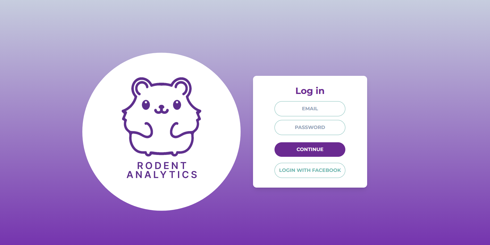
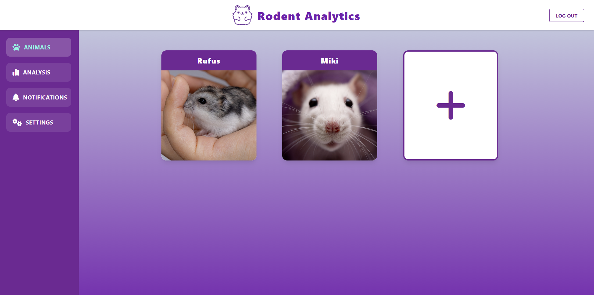
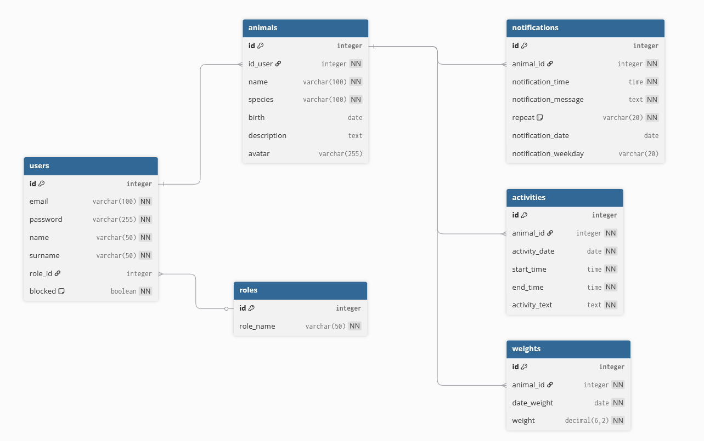

# Rodent Analysis

Take care of your rodents like never before! Our web and mobile application lets you easily add and manage information about your pet rodents. Track their daily activities, monitor their weight, and keep a detailed record of their well-being—all in one place.

With our intuitive interface, you can log important details about each of your rodents, including activity levels and weight changes.

Stay organized and gain valuable insights into your rodents’ habits, whether you’re at home or on the go. You can also set up custom notifications, so you never forget important tasks—like feeding, cleaning, or health checkups.

Perfect for all rodent owners who want to ensure the best care for their furry friends!

## Requirements

- [Docker](https://www.docker.com/get-started) and [Docker Compose](https://docs.docker.com/compose/install/) must be installed on your system.

## Installation

1. Clone the repository:
    ```sh
    git clone https://github.com/julpol00/ZTPAI-Rodent-Analytics-app.git
    cd <repository-folder>
    ```

2. Build and start backend and database using Docker Compose:
    ```sh
    docker-compose up --build
    ```
3. Build and start frontend (In the second terminal)
    ```cd frontend
    npm install
    npm run dev
    ```
4. Seed database (In third terminal)
    ```cd backend
    docker-compose exec backend npm run seed
    ```
3. The application and all required services (such as the database) are started now.

## Usage

- Once the containers are running, open your browser and go to [http://localhost:5173](http://localhost:5173)  
  *(Replace `5173` with your configured port if different)*

- Swagger documentation is avaiable on adress [http://localhost:3001/api-docs/#/](http://localhost:3001/api-docs/#/)

## Tech Stack

### Frontend

**React** – A JavaScript library for building modern, component-based user interfaces. I chose React because it enables fast development of dynamic and responsive web applications, and has a large ecosystem of ready-to-use components (e.g. for calendar and forms), which helped me create an intuitive and interactive UI for rodent management.

**Vite** – A fast bundler and development server for frontend applications. I selected Vite for its instant project startup, fast hot-reloading, and simple React environment configuration, which made my development workflow much smoother and more efficient compared to older tools.

**TailwindCSS** – Utility-first CSS framework that allows rapid and flexible styling of components without writing custom CSS classes. I chose TailwindCSS because I wanted to quickly create a modern, visually appealing, and responsive interface, and it made it easy to style elements like the calendar and dashboard without spending time on custom CSS.

**Node.js** – JavaScript runtime environment used for running development tools (such as Vite, npm) and the backend server outside the browser. Node.js was a natural choice because it allowed me to use JavaScript for both frontend and backend, simplifying the technology stack and speeding up development.

**npm** – Package manager for JavaScript, used to install and manage dependencies for both frontend and backend projects. npm is the standard for JavaScript projects and made it easy to add libraries and tools needed for my application.

### Backend

**Express.js** – Minimalist Node.js framework for building REST APIs. I chose Express.js because it is lightweight, easy to use, and well-documented, which allowed me to quickly build a robust API for my application and easily integrate authentication and routing.

**Sequelize** – ORM for Node.js, enabling convenient object-relational mapping and database management directly from JavaScript code. I selected Sequelize to simplify database operations, ensure data integrity, and avoid writing raw SQL queries, making my backend code cleaner and easier to maintain.

### Database

**MySQL** – Relational database used to store all application data (users, animals, activities, notifications, weights). I chose MySQL for its reliability, performance, and wide support in hosting environments. It is well-suited for structured data and ensures security and consistency for my application's data.

### DevOps / Infrastructure

**Docker** – Platform for containerizing applications, making it easy to run, scale, and manage backend, frontend, and database environments. I decided to use Docker to ensure my application runs consistently across different environments and to simplify deployment and collaboration.

**Docker Compose** – Tool for defining and running multi-container Docker applications. I chose Docker Compose because it allows me to start all application services with a single command, making local development and testing much easier and more reliable.


## Preview

### Login page



### Dashboard



### Pet Journal


### Notifications


## Data Base

### Diagram ERD for data base


