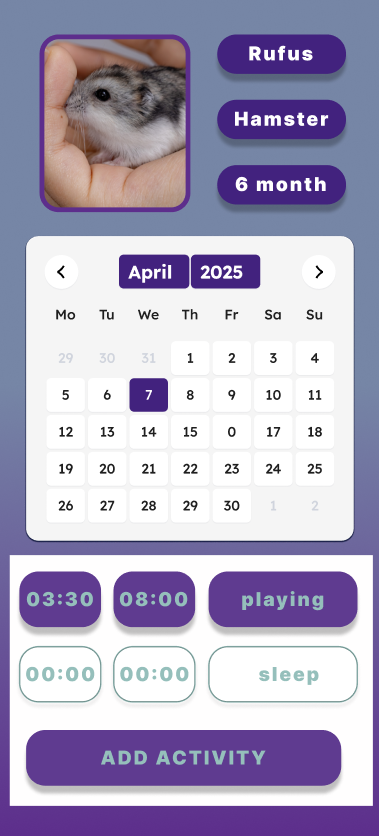

# ZTPAI Rodent Analytics app

## Prototype

## Mobile prototype

## Tech Stack
### Frontend

**Node.js** – Runtime environment for running JavaScript outside the browser.

**npm** – Package manager used to install and manage project dependencies.

**React** – JavaScript library for building modern, component-based user interfaces.

**TailwindCSS** – Utility-first CSS framework for fast and responsive styling.

### Database

**PostgreSQL** – Open-source relational database for secure and efficient data storage.
